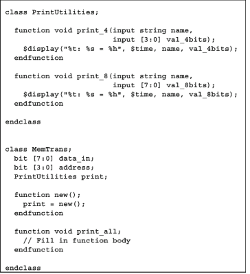

Chapter 5: Classes

Q1)Create a class called MemTrans that contains the following members, then construct a MemTrans object in an initial block.
a. An 8-bit data_in of logic type b. A 4-bit address of logic type c. A void function called print that prints out the value of data_in and address

```
class MemTrans;
  logic [7:0] data_in;
  logic [3:0] address;
  
  function void print();
    $display("Data =%0d Address=%0d",data_in,address);
  endfunction
endclass

module top;
  initial begin
    MemTrans mem;
    mem=new();
    mem.data_in=8'b1;
    mem.address=4'd2;
    mem.print();
  end
endmodule
```

Q2)Using the MemTrans class from Exercise 1, create a custom constructor, the new function, so that data_in and address are both initialized to 0.

```
class MemTrans;
  logic [7:0] data_in;
  logic [3:0] address;
  
  function new();
    data_in=8'b0;
    address=4'b0;
  endfunction
  function void print();
    $display("Data =%0d Address=%0d",data_in,address);
  endfunction
endclass

module top;
  initial begin
    MemTrans mem;
    mem=new();
    mem.print();
  end
endmodule
```

Q3)Using the MemTrans class from Exercise 1, create a custom constructor so that data_in and address are both initialized to 0 but can also be initialized through arguments passed into the constructor. In addition, write a program to perform the following tasks. a. Create two new MemTrans objects. b. Initialize address to 2 in the fi rst object, passing arguments by name. c. Initialize data_in to 3 and address to 4 in the second object, passing arguments by name.

```
class MemTrans;
  logic [7:0] data_in;
  logic [3:0] address;
  
  function new(input logic [7:0]data=8'b0, input logic [3:0]addr=4'b0);
    data_in=data;
    address=addr;
  endfunction
  function void print();
    $display("Data =%0d Address=%0d",data_in,address);
  endfunction
endclass

module top;
  initial begin
    MemTrans mem1,mem2;
    mem1=new(.addr(2));
    mem2=new(.data(3),.addr(4));
    mem1.print();mem2.print();
  end
endmodule
```

Q4)Modify the solution from Exercise 3 to perform the following tasks.
a. After construction, set the address of the fi rst object to 4’hF. b. Use the print function to print out the values of data_in and address for the two objects.
c. Explicitly deallocate the 2nd object.

```
class MemTrans;
  logic [7:0] data_in;
  logic [3:0] address;
  
  function new(input logic [7:0]data=8'b0, input logic [3:0]addr=4'b0);
    data_in=data;
    address=addr;
  endfunction
  function void print();
    $display("Data =%0d Address=%0d",data_in,address);
  endfunction
endclass

module top;
  initial begin
    MemTrans mem1,mem2;
    mem1=new(.addr(2));
    mem2=new(.data(3),.addr(4));
    mem1.address=4'hF;
    mem1.print();mem2.print();
    mem2=null;
  end
endmodule
```

Q5)Using the solution from Exercise 4, create a static variable last_address that holds the initial value of the address variable from the most recently created object, as set in the constructor. After allocating objects of class MemTrans (done in Exercise 4) print out the current value of last_address .

```
class MemTrans;
  logic [7:0] data_in;
  logic [3:0] address;
  static logic [7:0]last_address;
  function new(input logic [7:0]data=8'b0, input logic [3:0]addr=4'b0);
    data_in=data;
    address=addr;
    last_address=addr;
  endfunction
  function void print();
    $display("Data =%0d Address=%0d",data_in,address);
  endfunction
endclass

module top;
  initial begin
    MemTrans mem1;
    mem1=new(.addr(2));
    mem1.address=4'hF;
    mem1.print();
    $display("Static Last_Address=%0d",mem1.last_address);
  end
endmodule
```

Q6)Using the solution from Exercise 5, create a static method called print_last_ address that prints out the value of the static variable last_address . After allocating objects of class MemTrans , call the method print_last_address to print out the value of last_address .

```
class MemTrans;
  logic [7:0] data_in;
  logic [3:0] address;
  static logic [7:0]last_address;
  
  function new(input logic [7:0]data=8'b0, input logic [3:0]addr=4'b0);
    data_in=data;
    address=addr;
    last_address=addr;
  endfunction
  
  function void print();
    $display("Data =%0d Address=%0d",data_in,address);
  endfunction
  
  static function void print_last_address();
    $display("Static Last_Address=%0d",last_address);
  endfunction
endclass

module top;
  initial begin
    MemTrans mem1;
    mem1=new(.addr(2));
    mem1.address=4'hF;
    mem1.print();
    mem1.print_last_address();
  end
endmodule
```

Q7)Given the following code, complete the function print_all in class MemTrans to print out data_in and address using the class PrintUtilities . Demonstrate using the function print_all .





Q8)

Q9)

Chapter:
