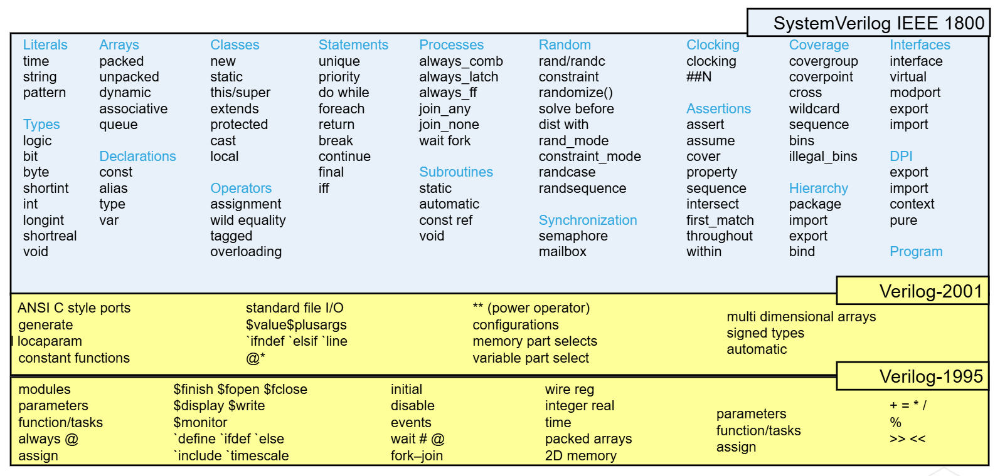

**Starting the SV with book/cadence**
SV is an extension of Verilog-2001



---

# ==>&emsp;&emsp;&emsp;&emsp;&emsp;**Data Types:**

---


| DataType | Description                     | Sign             | state        |
| :--------- | --------------------------------- | ------------------ | -------------- |
| bit      | 1bit                            | default unsigned | 2 state(0/1) |
| byte     | 8bit                            | default signed   | 2 state      |
| shortint | 16bit                           | default signed   | 2 state      |
| int      | 32bit                           | default signed   | 2 state      |
| longint  | 64bit                           | default signed   | 2 state      |
| integer  | 32bit                           | default signed   | 4 state      |
| logic    | 1bit                            | default unsigned | 4 state      |
| reg      | 1bit                            | default unsigned | 4 state      |
| wire     | 1bit                            | default unsigned | 4 state      |
| time     | 64bit                           | default unsigned | 4 state      |
| real     | double precision floating point |                  | 2 state      |

**Verilog has Strict Data type rules:**<br>
▪ Variables(registers)(integer, real, reg, time) are assigned values in procedural blocks.<br>
▪ Netsare driven by continuous assignments, module inputs, module instance outputs, or primitive instances.<br>

**=>These lead to the following connectivity characteristics:**<br>
▪ Module inputs are always nets.<br>
▪ Module outputs are variables if driven by a procedural block, or nets in all other cases.<br>
▪ Connections to the input ports of a module instance are variables if driven by a procedural block, or nets in all other cases.<br>
▪ Connections to the output ports of a module instance are always nets.<br>
▪ Connections to bidirectional inoutports are always nets.<br>

This means that module input ports must connect internally to nets, module output ports must connect
externally to nets, and module inoutports must connect both internally and externally to nets. Only
module output ports can connect internally to variables.<br>

### --> Sized Vs Unsized Literal:

```// Sized literal
//Sized Literal
// <size>'<base><value>
logic[5:0] databus;
databus =6'b0; // 000000
databus =6'b1; // 000001
databus =6'bz; // zzzzzz
databus =6'bx; // xxxxxx
databus =4'bx; // 00xxxx
// Unsized literal
// '<value>
logic[5:0] databus;
databus = '0;   // 000000
databus = '1;   // 111111
databus = 'z;   // zzzzzz
databus = 'x;   // xxxxxx
```

### Time Literal:

Time Literals are numbers written in integer or fixed-point format, followed without a space by a time unit (fs ps ns us ms s). e.g. 3.14ps, 5ns, 1step(Note: Always 1step is allowed never 2 step etc..)

timeunit:

timeprecision:

--> always_comb, always_latch, always_ff
