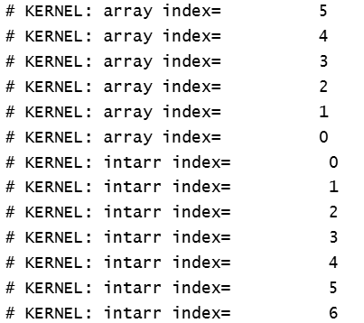

**Starting the SV with book/cadence**
SV is an extension of Verilog-2001


---

### ==>&emsp;&emsp;&emsp;&emsp;&emsp;**Data Types:**

---


| DataType | Description                     | Sign             | state        |
| :--------- | --------------------------------- | ------------------ | -------------- |
| bit      | 1bit                            | default unsigned | 2 state(0/1) |
| byte     | 8bit                            | default signed   | 2 state      |
| shortint | 16bit                           | default signed   | 2 state      |
| int      | 32bit                           | default signed   | 2 state      |
| longint  | 64bit                           | default signed   | 2 state      |
| integer  | 32bit                           | default signed   | 4 state      |
| logic    | 1bit                            | default unsigned | 4 state      |
| reg      | 1bit                            | default unsigned | 4 state      |
| wire     | 1bit                            | default unsigned | 4 state      |
| time     | 64bit                           | default unsigned | 4 state      |
| real     | double precision floating point |                  | 2 state      |

**Verilog has Strict Data type rules:**<br>
▪ Variables(registers)(integer, real, reg, time) are assigned values in procedural blocks.<br>
▪ Netsare driven by continuous assignments, module inputs, module instance outputs, or primitive instances.<br>

**=>These lead to the following connectivity characteristics:**<br>
▪ Module inputs are always nets.<br>
▪ Module outputs are variables if driven by a procedural block, or nets in all other cases.<br>
▪ Connections to the input ports of a module instance are variables if driven by a procedural block, or nets in all other cases.<br>
▪ Connections to the output ports of a module instance are always nets.<br>
▪ Connections to bidirectional inoutports are always nets.<br>

This means that module input ports must connect internally to nets, module output ports must connect
externally to nets, and module inoutports must connect both internally and externally to nets. Only
module output ports can connect internally to variables.

### Net Types:

wire/tri are functionally identical and share the same syntax, they are given different names to help designers convey the intended purpose of the net within the model.


| Net Type | Description                                                                                                                                                                                                                                      |                                                                                                                                               |
| ---------- | -------------------------------------------------------------------------------------------------------------------------------------------------------------------------------------------------------------------------------------------------- | ----------------------------------------------------------------------------------------------------------------------------------------------- |
| wire     | Connects elements with continuous assignment                                                                                                                                                                                                     |                                                                        |
| tri      | Connects elements with multiple drivers                                                                                                                                                                                                          |                                                                                                                                               |
| wor      | Creates wired OR configurations                                                                                                                                                                                                                  |                                                                       |
| trior    | Creates wired OR configurations with multiple drivers                                                                                                                                                                                            |                                                                                                                                               |
| wand     | Creates wired AND configurations                                                                                                                                                                                                                 |                                                                     |
| triand   | Creates wired AND configurations with multiple drivers                                                                                                                                                                                           |                                                                                                                                               |
| tri0     | Models nets with resistive pulldown devices                                                                                                                                                                                                      |                                                                            |
| tri1     | Models nets with resistive pullup devices                                                                                                                                                                                                        |                                                                            |
| trireg   | Stores a value and is used to model charge storage nodes<br /> The strength of the value held by a trireg net in the capacitive state can be specified as `small`, `medium`, or `large`. This strength is determined at the time of declaration. | `trireg` net can hold its last driven value when no drivers are active. This makes it suitable for modeling storage elements like capacitors. |
| uwire    | unidriver wire Models nets that can should be driven only by a single driver                                                                                                                                                                     |                                                                                                                                               |
| supply0  | Models power supply with a low level of strength                                                                                                                                                                                                 |                                                                                                                                               |
| supply1  | Models power supply with a high level of strength                                                                                                                                                                                                |                                                                                                                                               |

### --> Sized Vs Unsized Literal:

```// Sized literal
//Sized Literal
// <size>'<base><value>
logic[5:0] databus;
databus =6'b0; // 000000
databus =6'b1; // 000001
databus =6'bz; // zzzzzz
databus =6'bx; // xxxxxx
databus =4'bx; // 00xxxx
// Unsized literal
// '<value>
logic[5:0] databus;
databus = '0;   // 000000
databus = '1;   // 111111
databus = 'z;   // zzzzzz
databus = 'x;   // xxxxxx
```

### Time Literal:

Time Literals are numbers written in integer or fixed-point format, followed without a space by a time unit (fs ps ns us ms s). e.g. 3.14ps, 5ns, 1step(Note: Always 1step is allowed never 2 step etc..)

timeunit:

timeprecision:

**time_unit** specifies the time unit of measurement during simulation for your design or test-bench.<br>
**time_precision** specifies precision of time for time unit. Or in other way minimum time you are able to specify during simulation.

Inter vs Intra Delay, Time roundoffs

### Procedural statement and Procedural Blocks

case statement- Parallel case/Full Case, case, casex, casez, priority case, unique case, priority if, unique if, iff

Full case: Does your logic cover all the cases for each and variable achieving complete assignment. Avoids inferred latches.
Parallel Case: Are all the cases mutually exclusive? Overlapping cases can mean complex logic is involved to determine correct action.

In Verilog, ? is an alias for z in numerical literals

casex treats x and z as dont care <br/>
casez treats z as dont care

--> always_comb, always_latch, always_ff

foreach Loop: Note here when we arite [5:0] itr start from 5 and goes till 0 but when we write [6] itr starts from 0 and goes till 5

```
module try(); 
  int array[5:0];
  int intarr[7];
  initial begin
    foreach(array[i]) begin
      $display("array index=%d", i);
    end
    foreach(intarr[x]) begin
      $display("intarr index=%d", x);
    end
  end
endmodule
```

Here is the output:



Detail notes on Case Statements:

iff: Procddural event control, always@(avec iff enable==1)

Typical RTL use, always@(posedge clk iff(gate==1) or posedge rst)

Typical TB use, foreach(payload[i]) begin @(negedge clk iff(!suspend)) data_out <= payload[i]; end

### Operators

wildcard equality/inequality operator, inside operator

case, casex, casez, ==, ===, ==?, !=?

casez: consider ?/z as dont care

casez: consider ?/z/x as dont care

==: if any operands contain x/z output goes to x

===: operands can have x/z

==?: treat x/z in operands as dont care

!=?:

### OOPS

When to use virtual vs pure virtual?


| Situation                                     | Use**Virtual** or **Pure Virtual** ? |
| ----------------------------------------------- | -------------------------------------- |
| Base class should provide a default behavior  | `virtual function`                   |
| Every subclass**must** implement the function | `pure virtual function`              |

Shallow Copy vs Deep Copy


| Class Assignment                                                                                                       | Shallow Copy                                                                                                                     | Deep Copy                                                                                                        |
| ------------------------------------------------------------------------------------------------------------------------ | ---------------------------------------------------------------------------------------------------------------------------------- | ------------------------------------------------------------------------------------------------------------------ |
|  |  |  |
|                                                                                                                        |                                                                                                                                  |                                                                                                                  |

Packing Objects to and from Arrays Using Streaming Operators:<< and >> operator. Refer 5.15.4 from chris spears
